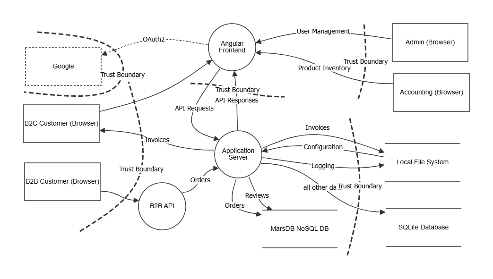
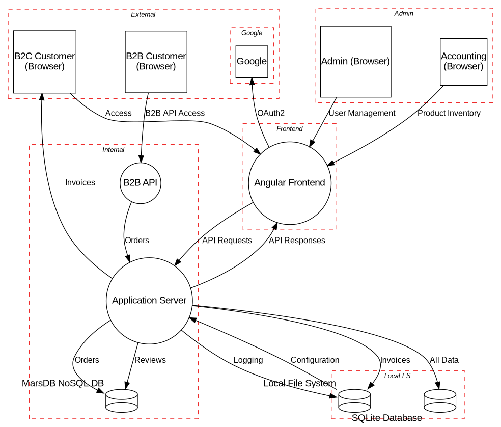

# Übung zu pyTM

Die folgenden Übungsteile dienen dazu, in das _Threat Modeling as Code_ mit [pyTM](https://github.com/OWASP/pytm) einzuführen.

## Einrichtung der pyTM Umgebung

Für die Übung muss die pyTM-Umgebung eingerichtet werden. Dazu sollten folgende Schritte ausgeführt werden:

- Clonen vom [pyTM Github Repo](https://github.com/OWASP/pytm.git)
- Installation einer virtuellen Python-Umgebung
- Aktivierung der virtuellen Python-Umgebung
- Installation von `graphviz` in die virtuelle Umgebung
- Installation von `plantuml.jar`

## Erstellung eines pyTM Modells für den OWASP Juice Shop

Als Basis für die Übung dient das [Threat Model](https://github.com/juice-shop/juice-shop/blob/master/threat-model.json) des OWASP Juice Shop. Aus dem [OWASP Threat Dragon](https://www.threatdragon.com/#/) kann man mit dem Modell folgendes DFD erzeugen:

> **AUFGABE:** Erstelle eine pyTM-Datei, die das OWASP Juice Shop DFD abbildet.

## Erstellung eines DFD mit pyTM

> **AUFGABE:** Erstelle mit Hilfe von pyTM eine DFD-Grafik aus dem Code, die möglichst der Abbildung unten entspricht.

## Erstellung eines Reports

> **AUFGABE:** Erstelle mit Hilfe des Templates `docs/basic_template.md` einen Report und schaue ihn Dir im Browser an. Nutze dafür die vorher erstellt Grafik.

## Erstellung einer JSON-Übersicht

> **AUFGABE:** Erstelle eine JSON-Übersicht über die Bedrohungen und analysiere verschiedene Aspekte mit [`jq`](https://jqlang.org/).

## Diskussion der Nutzung von pyTM

> **AUFGABE:** Diskussion in der Gruppe über die Nutzung von pyTM.
