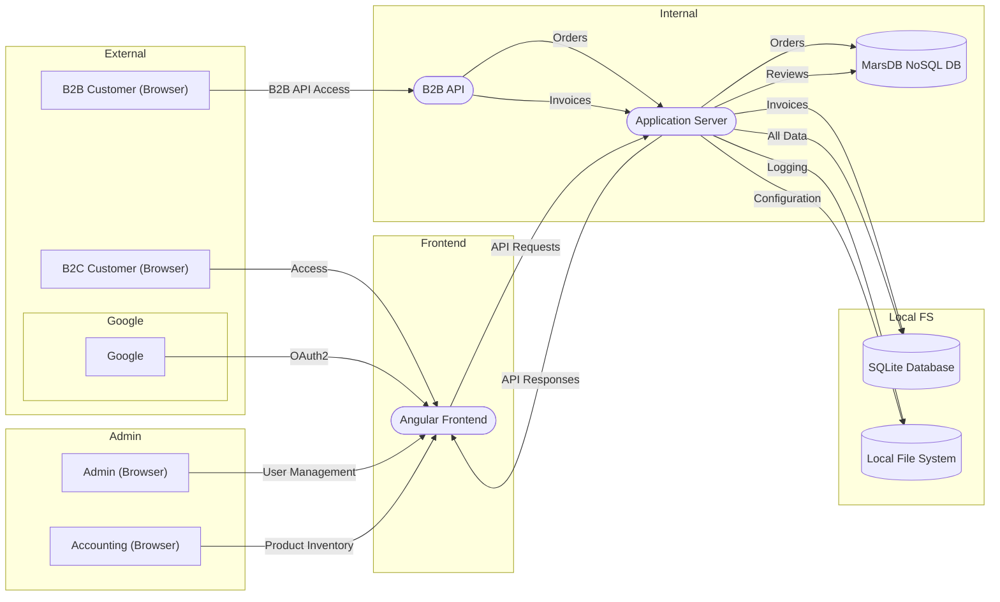

# pyTM Threat Modeling

## Vorbereitung pyTM

### Erstellen einer virtuellen Python-Umgebung und Installation von Modulen

```bash
git clone https://github.com/OWASP/pytm.git
cd pytm
```

```bash
python3 -m venv .venv
```

```bash
source .venv/bin/activate
```

```bash
pip install graphviz
```

```bash
curl -L -o plantuml.jar https://github.com/plantuml/plantuml/releases/latest/download/plantuml.jar
```

## OWASP Juice Shopt Threat Model

[OWASP Juice Shop Threat Model](https://github.com/juice-shop/juice-shop/blob/master/threat-model.json)

### pyTM Code

```python
import graphviz
from pytm import TM, Actor, Process, Datastore, Dataflow, Boundary

# Threat Model definieren
tm = TM("OWASP Juice Shop",
        owner="Björn Kimminich",
        description="OWASP Juice Shop is a modern insecure web application for security training and testing.")

google_boundary = Boundary("Google")
external_boundary = Boundary("External")
admin_boundary = Boundary("Admin")
local_boundary = Boundary("Local FS")
angular_boundary = Boundary("Frontend")
internal_boundary = Boundary("Internal")

# Elemente anlegen
b2c = Actor("B2C Customer (Browser)")
b2c.inBoundary = external_boundary
google = Actor("Google", outOfScope=True)
google.inBoundary = google_boundary
google_boundary.inBoundary = external_boundary
angular = Process("Angular Frontend")
angular.inBoundary = angular_boundary
app_server = Process("Application Server")
app_server.inBoundary = internal_boundary
sqlite_db = Datastore("SQLite Database")
sqlite_db.inBoundary = local_boundary
nosql_db = Datastore("MarsDB NoSQL DB")
nosql_db.inBoundary = internal_boundary
local_fs = Datastore("Local File System")
local_fs.inBoundary = local_boundary
b2b = Actor("B2B Customer (Browser)")
b2b.inBoundary = external_boundary
b2b_api = Process("B2B API")
b2b_api.inBoundary = internal_boundary
admin = Actor("Admin (Browser)")
admin.inBoundary = admin_boundary
accounting = Actor("Accounting (Browser)")
accounting.inBoundary = admin_boundary

# Datenflüsse definieren
Dataflow(b2c, angular, name="Access")
Dataflow(angular, google, name="OAuth2", isPublicNetwork=True, isEncrypted=True)
Dataflow(angular, app_server, name="API Requests")
Dataflow(app_server, angular, name="API Responses")
Dataflow(app_server, local_fs, name="Invoices")
Dataflow(b2b, b2b_api, name="B2B API Access")
Dataflow(b2b_api, app_server, name="Orders")
Dataflow(accounting, angular, name="Product Inventory")
Dataflow(admin, angular, name="User Management")
Dataflow(app_server, sqlite_db, name="All Data")
Dataflow(app_server, nosql_db, name="Orders")
Dataflow(app_server, nosql_db, name="Reviews")
Dataflow(app_server, b2c, name="Invoices", isPublicNetwork=True)
Dataflow(local_fs, app_server, name="Configuration")
Dataflow(app_server, local_fs, name="Logging")

# Threat Model verarbeiten
tm.process()
```

## pyTM Aufrufe

### Erzeugung DFD

```bash
python3 ./test.py --dfd | dot -Tpng -o sample.png
```

### Erzeugung Report

```bash
python3 test.py --report docs/basic_template.md | pandoc -f markdown -t html > ./test.html
```

### Erzeugung Sequence Diagram

```bash
python3 test.py --seq | java -Djava.awt.headless=true -jar ./plantuml.jar -tpng -pipe > ./seq.png
```

### Erzeugung JSON-Übersicht

```bash
python3 test.py --json ./test.json
```

#### Analyse mit [`jq`](https://jqlang.org/)

```bash
jq 'keys' test.json
```

```bash
jq '.actors[] | .name' test.json
```

```bash
jq '.assets[] | .name' test.json
```

```bash
jq -r 'paths(scalars) as $p | "\($p | join(".")): \(getpath($p))"' test.json
```

## Mermaid Flowchart

Ein zusätzliches Beispiel, um ein DFD mit [Mermaid](https://mermaid.js.org/) zu erstellen. Kann in einem [Online-Editor](https://mermaid.live/) ausprobiert werden:

